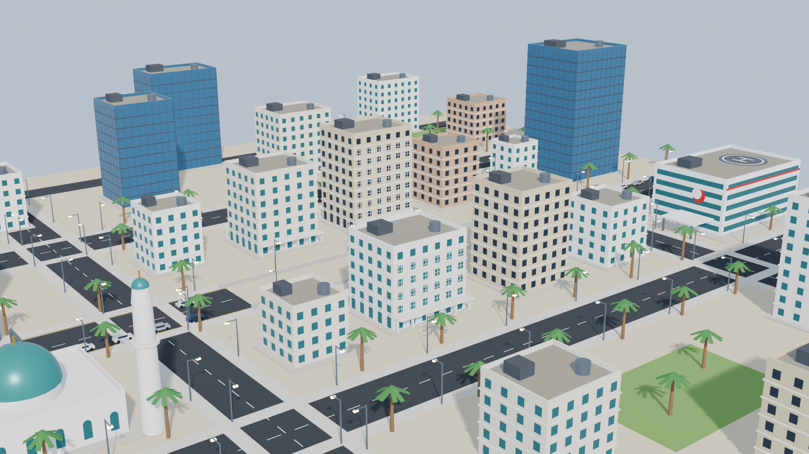
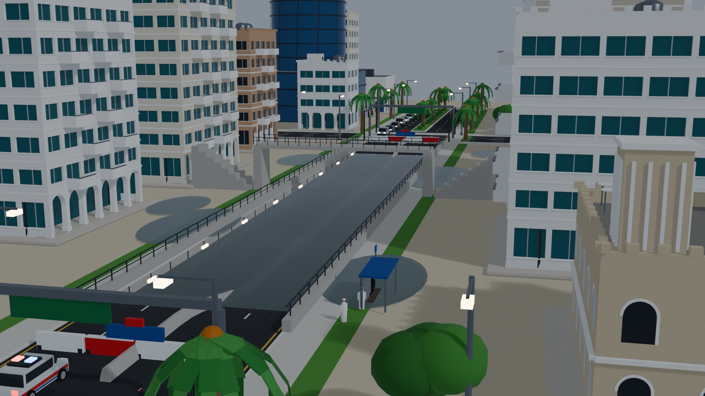
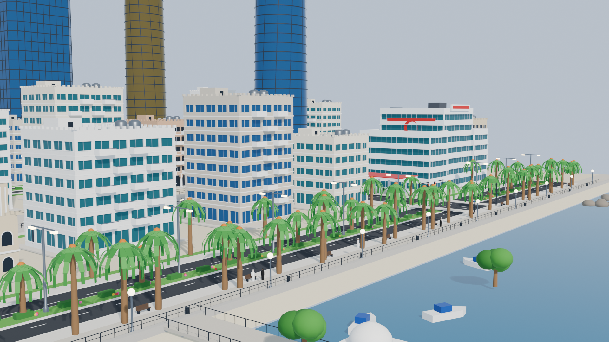

# AMAN 360

**AI-Powered Emergency Communication Assurance & Response Intelligence**

> Existing systems detect the emergency. AMAN makes sure the right person receives the right verified action — and tells government what happened next.

AMAN 360 is a government-grade prototype of a last-mile emergency communication platform. It is **not** a flood prediction system, a weather engine, a generic alert app or a surveillance system. It starts after the hazard is known and answers six questions:

1. Who is actually affected?
2. What should that specific person do?
3. How should that instruction be communicated clearly?
4. Did the person respond?
5. Who still needs help?
6. Are all government communication channels consistent and verified?

The prototype demonstrates one complete end-to-end scenario — a **flash flood in an urban underpass** — through an operator command platform and an interactive 3D digital twin built in Blender.

| Digital twin (Blender render) | Flooded underpass, closure deployed | Corniche waterfront and skyline |
| --- | --- | --- |
|  |  |  |

The district is an Abu Dhabi-style synthetic district: curved and twisted glass towers on the skyline, arcaded mid-rise residences with balconies and merlons, Emirati villas with wind towers, a Grand-Mosque-style complex, a medical centre, landscaped boulevards, and the Corniche with its promenade, pier and sea. In the web twin the flood water is rendered as a turbid, rippling surface with rain rings, foam and drifting debris.

---

## Product architecture

AMAN separates two intelligence layers, and the UI labels every panel with the layer that produced it.

| Layer | Role | Implementation |
| --- | --- | --- |
| **Deterministic safety layer** (teal) | Safety-critical decisions. Never depends on a language model. | `src/lib/engine/` — geometry, routing, source assurance, impact rules R-01…R-08, escalation rules E-01…E-04, channel-consistency checks, triage scoring |
| **AI communication intelligence** (violet) | Wording, language, accessibility, channel adaptation, classification, summaries. Every output carries a visible trace (inputs, constraints, rationale, confidence, review flag). | `src/lib/ai/` — simulated model behind a provider boundary (`provider.ts`) |

The scenario builder (`src/lib/simulation/scenario.ts`) turns a step index into one immutable state object that every screen — dashboard, 2D map and 3D twin — renders from.

```
src/
  app/                    Next.js App Router
    page.tsx              Landing page (live 3D hero)
    command/              Command centre shell + screens
      page.tsx            Overview (KPIs, 3D situation view, assurance, timeline, operator queue)
      twin/               Full-screen 3D digital twin
      assurance/          Source verification & contradiction resolution
      population/         Person-level impact view
      composer/           Communication composer — one truth, many channels
      triage/             Citizen response triage & government intelligence
  components/
    shell/ ui/ map/ overview/ assurance/ population/ composer/ twin/ landing/
  lib/
    data/                 Synthetic district, people, sources, SOP catalogue
    engine/               Deterministic safety layer
    ai/                   AI communication layer (simulated)
    simulation/           Steps, script, scenario builder, store, visual helpers
    twin/                 3D coordinate helpers and camera presets
blender/
  build_district.py       Procedural district + flood animation generator (run inside Blender)
  aman_district.blend     Saved scene
public/models/district.glb  Exported twin (geometry, materials, flood animation)
```

## The flash-flood scenario

| # | Step | What happens |
| --- | --- | --- |
| 0 | Normal operations | Calm district, all feeds nominal |
| 1 | Flash flood onset | Rain, water accumulates in the Al Majaz underpass; NCM alert, GIS polygon, police closure and a stale public web page arrive |
| 2 | Communication assurance | Police (CLOSED) contradicts the portal (OPEN); the source hierarchy resolves it; a verified fact is published |
| 3 | Impact analysis | Route × closure and polygon checks for every registered person; approved action selected; alerts suppressed for the unaffected |
| 4 | Personalised communication | Bilingual, accessibility-aware messages composed from approved actions; an outdoor instruction is held for operator confirmation |
| 5 | Multi-channel delivery | SMS, app, voice, website, signage and call-centre script — all checked against the verified statement |
| 6 | Citizen response loop | Safe confirmations, an assistance request, a clarification, a different situation, and silence |
| 7 | Triage & intelligence | Explainable priority scoring, dispatch of an accessible ambulance, escalations for the unresponsive |
| 8 | Operational picture | Reached, safe, assisted, unconfirmed — the picture government needs |

Demo residents (all synthetic): **Ahmed** (driving toward the closure → rerouted, +6 min), **Fatima** (at home inside the polygon → shelter in place), **Sara** (wheelchair user → accessible assistance, requests help, ambulance dispatched), **Omar** (outside the impact area → no alert), **Layla** (walking beside the underpass → move to assembly point, reports a different situation), **Yusuf** (74, no smartphone → SMS + voice, silent → welfare check).

## Running the prototype

Prerequisites: Node.js 20+ (tested with 22) and npm.

```bash
npm install
npm run dev
```

Open http://localhost:3000. The landing page links into the command centre.

Keyboard shortcuts inside the command centre: **Space** play / pause, **→ / ←** next / previous step, **0–8** jump to a step, **R** reset. The EN / AR toggle switches every message preview.

Deep links for demos: `/command/twin?step=6&cam=overview`, `?step=2&cam=underpass`, `?step=8&cam=hospital`, `?step=0&cam=corniche&play=1` (cameras: auto, overview, underpass, closure, impact, residence, hospital, corniche, follow). Add `&debug=1` for on-screen renderer diagnostics.

The twin is a living district, not only a flood: boulevard traffic that slows in the rain, pedestrians on the Corniche, drifting boats, birds, a waving UAE flag, cycling traffic signals, lightning during the storm, a medevac helicopter that lands on the medical-centre helipad during dispatch, a Civil Defence unit, a cell-broadcast tower that pulses when messages go out, a live drainage sensor, and an environment panel with rainfall, wind and underpass water level. The **Layers** menu in the twin toggles hazard, routes, people, units, sensors and activity.

Production build:

```bash
npm run build && npm start
```

## Rebuilding the 3D twin in Blender

The district is generated procedurally (Blender 4.2+ / 5.x) by `blender/build_district.py`, which loads `blender/lib_mesh.py` (mesh builder, facade frames, materials), `blender/gen_buildings.py` (arcaded residences with recessed windows and balconies, curved and slab glass towers, Emirati villas with wind towers, the mosque complex, the medical centre) and `blender/gen_streets.py` (boulevards with landscaped medians, the sunken underpass, signals, lamps, palms, the Corniche waterfront, vehicles and pedestrians). The underpass water level and the spreading puddles are keyframed in Blender. In Blender's Python console or a Text Editor:

```python
exec(compile(open(r"<repo>/blender/build_district.py").read(), "build_district.py", "exec"))
```

Then export with `File → Export → glTF 2.0` (GLB, *Animation mode: Scene*, Draco compression on) to `public/models/district.glb`, or run the export snippet used during development:

```python
bpy.ops.export_scene.gltf(filepath="public/models/district.glb", export_format="GLB", export_apply=True,
                          export_animations=True, export_animation_mode="SCENE", export_yup=True,
                          export_draco_mesh_compression_enable=True)
```

The Draco decoder is served from `public/draco/` (copied from three.js). The web twin scrubs the Blender animation from the simulation state, renders the flood as a planar-reflective surface with rain-ripple normals, depth tint and rain rings, adds a sea shader, sky-driven environment reflections and post-processing (ambient occlusion, bloom, anti-aliasing), overlays hazard polygons, verified routes and live labels, drives vehicles along engine-computed paths, and renders the variable-message sign from the same verified statement as every other channel.

## Data, privacy and ethics

- All user profiles and locations shown in this prototype are synthetic.
- A real deployment would rely only on authorised institutional data (building registries, vulnerable-persons registries, cell broadcast) and/or user-consented data.
- No individual tracking is implied: road users are matched by consented navigation session or cell-broadcast segment.
- Every decision carries a rule trace; every AI output carries its inputs, constraints and confidence.
- KPIs are prototype figures for demonstration and are not validated real-world claims.

## Technology

Next.js 16 · React 19 · TypeScript · Tailwind CSS 4 · Zustand · Motion · React Three Fiber + drei · three.js · Blender (procedural generation, animation, glTF export).

See [DEMO_SCRIPT.md](DEMO_SCRIPT.md) for the presenter walkthrough.
